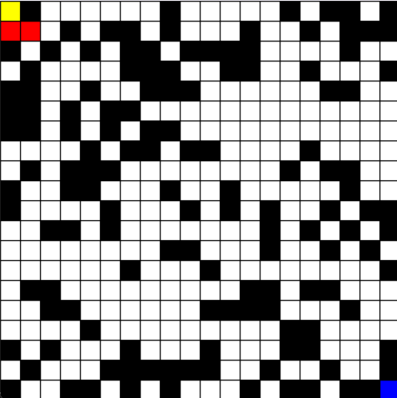
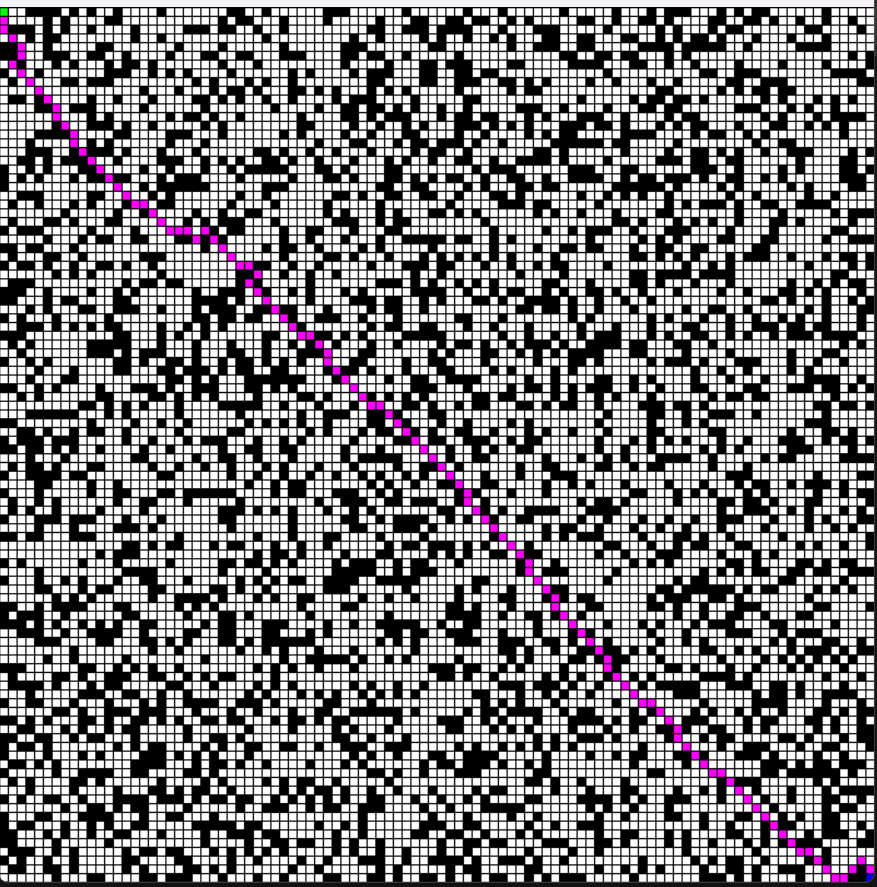
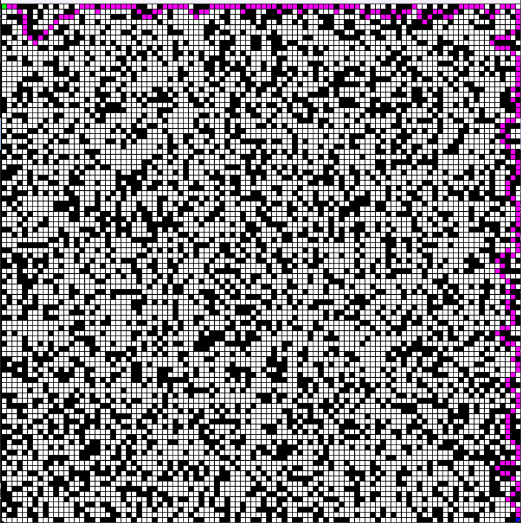
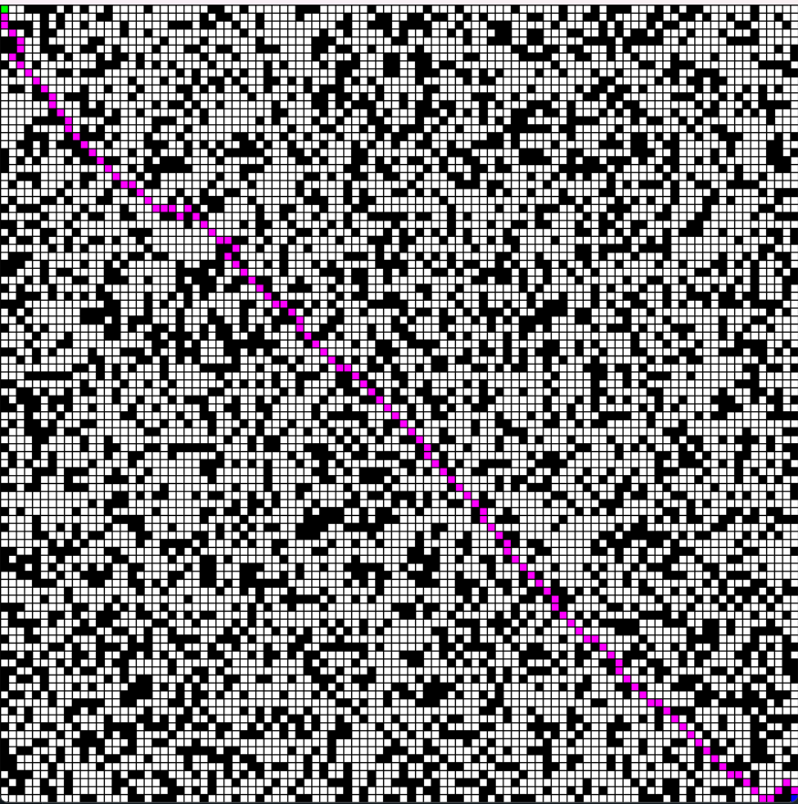
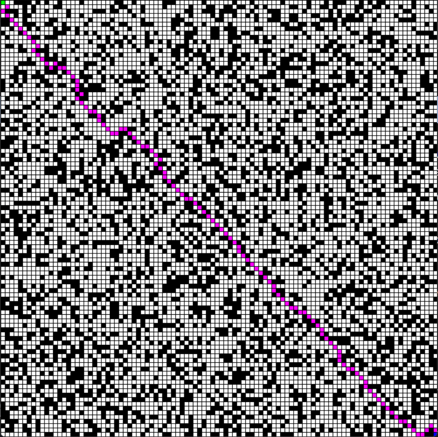

# Search-Based-Problem-Solving

The field of artificial intelligence (AI) is constantly evolving, with the development of new algorithms and techniques to solve complex problems. Search algorithms are a fundamental tool in AI, used in a wide range of applications such as planning, games, and robotics.

This work proposes the implementation and comparison of three search algorithms: Depth-first search, Uniform cost search, and A* search. The basis for comparing the algorithms consisted of a map composed of white squares (representing possible paths) and black squares (indicating blocked areas).

# Solução de Problemas por Busca

## Introdução
The field of Artificial Intelligence (AI) is constantly evolving, with the development of new algorithms and techniques to solve complex problems. Search algorithms are a fundamental tool in AI, used in a wide range of applications such as planning, games, and robotics.

This work proposes the implementation and comparison of four search algorithms: Breadth-First Search, Depth-First Search, Uniform Cost Search, and A* Search. The basis for the comparison of the algorithms consisted of a map composed of white squares (representing possible paths) and black squares (indicating blocked areas). As an example, a 20x20 map is presented below:

## Fundamentação Teórica
### Breadth First Search (BFS)
O algoritmo BFS (Breadth-First Search) é uma abordagem de busca em grafos que explora sistematicamente os vértices em camadas sucessivas. Ele é comumente aplicado em problemas de busca de caminho, encontrando o caminho mais curto entre dois vértices em um grafo não ponderado.

### Depth First Search (DFS)
O algoritmo DFS (Depth-First Search) é uma técnica de exploração de grafos que prioriza a profundidade antes da amplitude. Ele é frequentemente empregado em problemas de busca de caminho e é especialmente eficaz em grafos densos.

### Uniform Cost Search (UCS)
O algoritmo UCS (Uniform Cost Search) é um método de busca em grafos que prioriza a exploração de caminhos com o menor custo acumulado. Ele é eficaz em problemas de busca de caminho em grafos ponderados.

### A* (A-Star)
O algoritmo A* (A-star) incorpora heurística em sua abordagem de busca informada. Ele prioriza a exploração de caminhos que minimizam a soma do custo real e da estimativa heurística.

## Experimentos
### Configurações do Computador
Os experimentos foram conduzidos em um computador com as seguintes configurações:
- Processador: 11th Gen Intel(R) Core(TM) i5-1135G7
- Memória RAM: DDR4, 8 GBytes
- Placa mãe: NP550XDS-KF6BR
- Placa gráfica: Intel Iris Xe Graphics
- Sistema Operacional: Windows 11 Pro
- Memória: 256Gb SSD

### Ambiente de Teste
Os experimentos foram realizados em um labirinto 100x100 com 40% de bloqueio.

### Breadth First Search (BFS)
O algoritmo BFS é eficiente para encontrar o caminho mais curto em um labirinto com bloqueios. No entanto, pode levar um tempo de execução significativo em labirintos grandes.

### Depth First Search (DFS)
O algoritmo DFS percorreu toda a margem do labirinto até encontrar a solução. Embora eficiente no tempo de execução, não garantiu sucesso em encontrar o caminho mais curto.

### Uniform Cost Search (UCS)
O UCS apresentou resultados similares ao BFS, pois ambos priorizam a busca em direção ao objetivo de maneira ampla.

### A* (A-Star)
O A* superou as expectativas, alcançando custos de caminho comparáveis ao BFS e UCS, com um tempo de execução significativamente inferior.

## Resultados
### Custo do Caminho e Nº de Passos
| Algoritmo | Custo do Caminho | Nº de Passos |
|-----------|-------------------|--------------|
| BFS       | 153.52            | 115          |
| DFS       | 258.98            | 213          |
| A-Star    | 157.76            | 118          |
| UCS       | 153.52            | 115          |

### Nº total de Nós Expandidos e Tempo Total
| Algoritmo | Nº total de Nós Expandidos | Tempo Total (s) |
|-----------|-----------------------------|------------------|
| BFS       | 6701                        | 168.39           |
| DFS       | 260                         | 5.53             |
| A-Star    | 208                         | 4.41             |
| UCS       | 6704                        | 164.98           |

## Conclusão
A análise dos resultados proporcionou insights valiosos sobre o desempenho dos algoritmos de busca em um contexto específico. O Breadth-First Search (BFS) mostrou eficácia ao encontrar a solução com o menor custo de caminho em ambientes com bloqueios, mas seu tempo de execução em labirintos grandes era significativo. O Depth-First Search (DFS) apresentou eficiência no tempo de execução, mas com um custo de caminho mais elevado. O Uniform Cost Search (UCS) e o Breadth-First Search (BFS) exibiram resultados muito semelhantes. O A* (A-Star) superou as expectativas, alcançando custos de caminho comparáveis ao BFS e UCS, com um tempo de execução notavelmente inferior.
